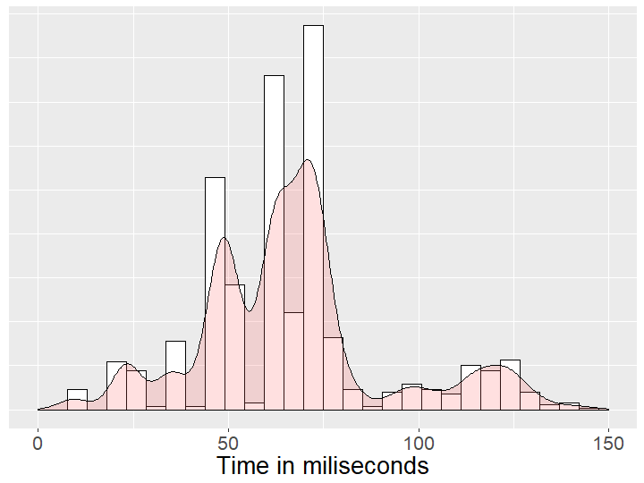

```{r setup, include=FALSE}
knitr::opts_chunk$set(echo = FALSE)
```

## Why predict text?

Mobile devices require different approach to text input, than desktop computers. Touchscreens, that definitely replaced physical keyboards, come with a few challenges: **they are smaller and provide little tactile feedback**.

A software solution is needed to compensate for those shortcomings:

- increasing the typing speed
- reducing the number of errors

Natural Language Processing comes in handy - it allows to predict users input, like next word, based on provided source material. **The presented app uses an algorithm called SBO model to predict the next word**.

## Accuracy / performance balance

Model's accuracy is usually the most important measure of success in data science. However, when building a text prediction app, the **accuracy has to be balanced with performance - the speed of generating results**.

This app was built with a simple assumption: *it will predict the next word without LIVE, without waiting for predictions to appear*

This goal has been achieved. The average loading time for a prediction is **200 miliseconds**

```{r, out.width = "400px", fig.align='center'}

```

## Understandability

The app is based on a powerful, yet clear and understandable text prediction model, called [SBO](https://www.aclweb.org/anthology/D07-1090). The idea behind it can be summarized on single slide:

- We take last 3 words of the user's input and check what words appear after those 3 words in our data
- Each of those predictions is given a score - the more often it occurs, the higher the score
- Then we take *only the last 2 words* and repeat the procedure. However...
- The scores from this two-word prediction receive a penalty, as they are based on less data
- We repeat the above steps up to predicting from 0 words. The penalty is increased with every step
- We display three predictions with the highest scores


## Simplicity

The app is intentionally as simple, as possible in order to improve user experience.

- No buttons
- No unnecessary elements
- Simple layout
- Just open and start typing to see predictions

```{r, out.width = "500px", fig.align='center'}

```


